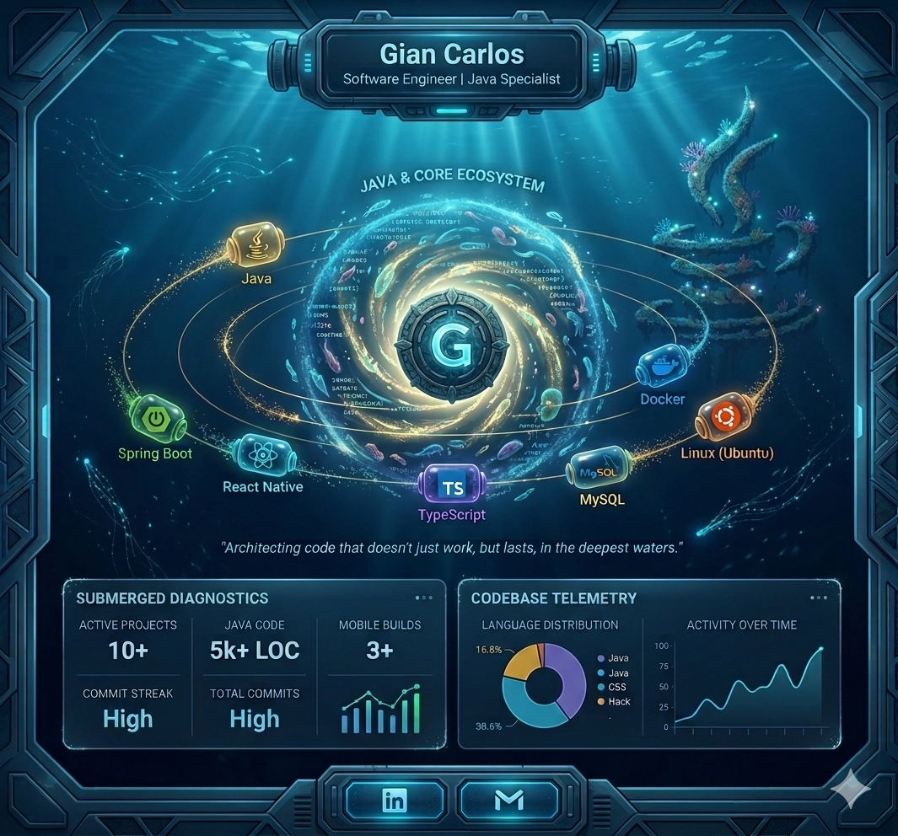

  

   

  
  
  
   
  
  

---

### 🖥️ LOG.DETAILED: PROFILE_DATA

* 🌍 **BASE:** Brasil 🇧🇷
* 🚀 **FOCO:** Ecossistema Java & Arquitetura de Software.
* 📱 **MOBILE:** React Native & TypeScript.
* 🛠️ **AMBIENTE:** Linux (Ubuntu).

---

### 📂 PROJETOS EM DESTAQUE

<table width="100%">
  <tr>
    <td width="50%" valign="top">
      <h4>🏨 Gerenciador de Hotéis</h4>
      
Backend robusto com Spring Boot, Docker e MySQL.

      <a href="https://github.com/GianCarlosDev/gerenciador-hoteis"><strong>[ ACESSAR REPOSITÓRIO ]</strong></a>
    </td>
    <td width="50%" valign="top">
      <h4>📊 Agregador de Investimentos</h4>
      
Análise de mercado e verificação de ativos em tempo real.

      <a href="https://github.com/GianCarlosDev/agregador-de-investimento"><strong>[ ACESSAR REPOSITÓRIO ]</strong></a>
    </td>
  </tr>
</table>

---

### 🤝 CONECTE-SE AO SISTEMA

  
  

 

  

