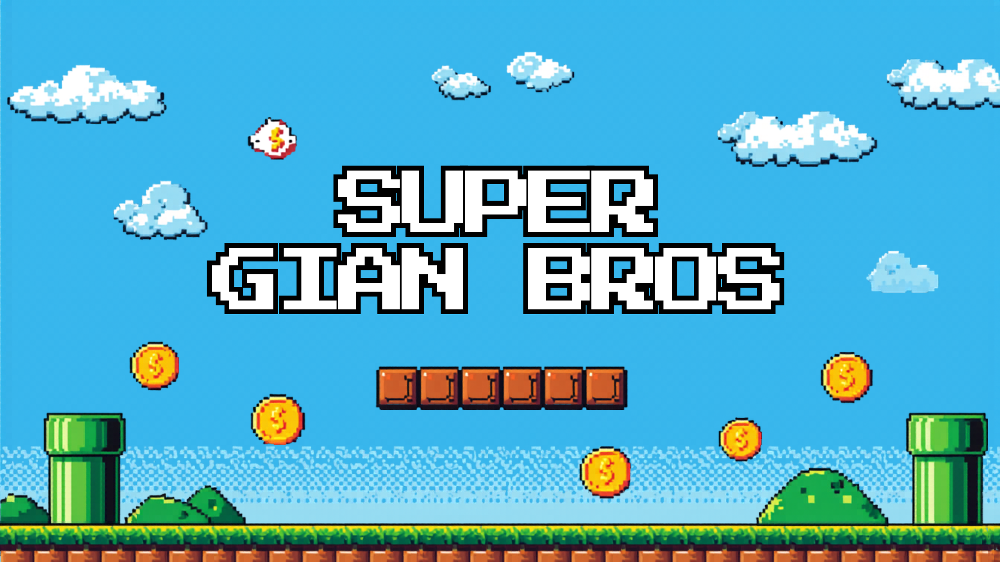

<h1 align="center">🍄 SUPER GIAN BROS 🍄</h1>

  

  <b>▶ PRESS START</b>

---

## 🎮 PLAYER STATUS

<table>
  <tr>
    <td><b>🎮 Player</b></td>
    <td>Gian Carlos</td>
  </tr>
  <tr>
    <td><b>🎓 Classe</b></td>
    <td>Sistemas de Informação</td>
  </tr>
  <tr>
    <td><b>🧠 Especialidade</b></td>
    <td>Backend Developer</td>
  </tr>
  <tr>
    <td><b>🌎 Região</b></td>
    <td>Brasil</td>
  </tr>
  <tr>
    <td><b>⚡ Level</b></td>
    <td>99</td>
  </tr>
  <tr>
    <td><b>🛠️ Stack</b></td>
    <td>Java • Spring • MySQL • Typescript • React Native</td>
  </tr>
</table>

---

<b>🔥 XP</b> 
███████░░░

<b>❤️ HP</b> 
██████████

---

## 🌍 WORLD 1 — SOBRE MIM

▶ Clique para iniciar missão

Carregando dados do jogador...

👨 Nome: Gian Carlos
🎓 Estudante de Sistemas de Informação
🧠 Backend Developer

🏆 Certificações:
- Java
- Spring Boot
- MySQL

🎯 Missão atual:
Evoluir como desenvolvedor backend e construir
aplicações robustas, escaláveis e bem estruturadas.

🔥 Status:
Em constante evolução...

---

## 🧰 WORLD 2 — POWER-UPS (SKILLS)

  🍄 Power Collected:

---

## 👾 WORLD 3 — BOSS FIGHTS (PROJETO)
🧘 Viva Zen
🚧 Status: EM DESENVOLVIMENTO

Aplicativo focado em meditação e bem-estar

🎯 Objetivo:
Ajudar usuários a relaxar, reduzir ansiedade e melhorar o foco

🧠 Stack:
- React Native
- Expo
- Áudio

🔥 Diferencial:
Experiência imersiva com sons relaxantes

⚡ Próximo nível:
- Finalizar funcionalidades principais
- Melhorar UX
- Publicação inicial

---
  
## 📊 WORLD 4 PLAYER STATS

p>

---

## 🏆 WORLD 5 — ACHIEVEMENTS

🎯 Foco profissional:
Desenvolvimento backend com Java e Spring Boot,
construindo APIs seguras, escaláveis e bem estruturadas

📚 Formação:
Estudante de Sistemas de Informação

🏆 Certificações:
- Java
- Spring Boot
- MySQL

🚀 Em evolução:
- Desenvolvimento de aplicações mobile (React Native)
- Integração entre frontend e backend
- Boas práticas de arquitetura e código limpo

⚡ Diferenciais:
- Aprendizado rápido
- Organização e disciplina
- Foco em evolução contínua

  ---

## 📡 FINAL STAGE — CONTATO

📡 LinkedIn: https://linkedin.com/in/gian-carlos-10715a202

📡 GitHub: https://github.com/GianCarlosDev

📡 Email: gcmendoncasilva@email.com

 
   

 <b>🏁 COURSE CLEAR!</b>  <b>CONTINUE ▶</b> 
  
 ``
